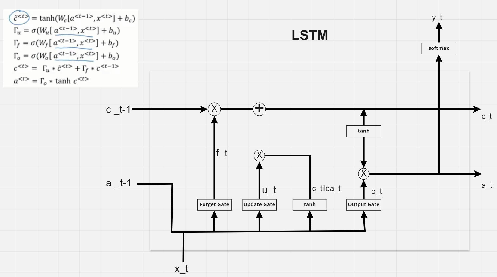

# Kodluyoruz & Carbon Consulting Veri Bilimi Bootcamp'i

Bootcamp hakkında genel bilgi almak için [buradaki](https://www.kodluyoruz.org/bootcamp/kodluyoruz-veri-bilimi-bootcamp/) linke tıklayabilirsiniz.

Bu repository'de ise eğitimde kullanılan sunumlar, gösterilen notebooklar ve üzerinde konuşmuş olduğumuz materyallere kolayca ulaşabilmeniz için paylaşıyor olacağız.

# Dosyalama Yapısı
- **Week01** .... **WeekN**: Haftalık içeriğin bulunduğu klasörler. İçeriğinde sunum, kod ve readme dosyalarında o hafta için önerilen kaynaklar bulunabilir.

# Yardimci linkler

- https://www.youtube.com/playlist?list=PLoROMvodv4rOhcuXMZkNm7j3fVwBBY42z
- https://www.coursera.org/professional-certificates/tensorflow-in-practice#courses
- https://www.coursera.org/specializations/deep-learning#courses
- https://web.stanford.edu/~jurafsky/slp3/
- https://www.youtube.com/playlist?list=PLLssT5z_DsK8HbD2sPcUIDfQ7zmBarMYv
- https://www.youtube.com/playlist?list=PLoROMvodv4rOhcuXMZkNm7j3fVwBBY42z

# Okunmasi önerilen makaleler

- https://arxiv.org/pdf/1409.0473.pdf
- https://arxiv.org/pdf/1706.03762.pdf
- https://arxiv.org/pdf/1810.04805.pdf
- https://jalammar.github.io/

# Huggingface

- https://huggingface.co/models
- https://huggingface.co/datasets
- https://huggingface.co/spaces

# Docker

- https://medium.com/carbon-consulting/things-you-need-to-know-about-docker-to-get-started-565979482a86
- https://youtu.be/fqMOX6JJhGo

# Kod örnekleri için

- https://colab.research.google.com/github/ageron/handson-ml2/blob/master/16_nlp_with_rnns_and_attention.ipynb#scrollTo=jKMU8QjjyYMZ
- https://github.com/PacktPublishing/Mastering-Transformers

